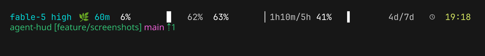

# agent-hud

Fast two-line statusline for [Claude Code](https://code.claude.com). One
foreground Bun process per render, zero runtime dependencies.

- Shows the model and its reasoning effort
- Shows how much context is left and the cache hit rate
- Bars for the 5-hour and 7-day rate limits, with time until you hit them
- Clock
- Repo name, branch, and how far you are from trunk (jj and git)
- Sessions share rate-limit numbers through a small on-disk DB, so every pane
  stays current even when only one is talking to the API
- Idle refreshes wait for the minute to tick over, so the clock is never stale



Regenerate the screenshot with `bun run screenshots`.

## Install

**Nix:**

```sh
nix run github:meatcar/agent-hud
```

**Homebrew:**

```sh
brew tap oven-sh/bun # bun is not in homebrew-core
brew tap meatcar/tap https://github.com/meatcar/homebrew-tap
brew trust oven-sh/bun # non-interactive shells only;
brew trust meatcar/tap # interactive brew prompts instead
brew install --HEAD meatcar/tap/agent-hud
```

**npm / bun:**

```sh
bun install -g @meatcar/agent-hud
```

**Git:**

```sh
git clone https://github.com/meatcar/agent-hud.git && cd agent-hud && bun link
```

## Setup

Point Claude Code at it in `~/.claude/settings.json`:

```json
{
  "statusLine": { "type": "command", "command": "agent-hud" }
}
```

It reads the statusline JSON Claude Code writes to stdin and prints two ANSI lines.
Try it by hand:

```sh
echo '{}' | agent-hud
```

## Custom layout

Available sections are `model`, `context`, `rate-limits`, `clock`, and `vcs`.
Empty sections are omitted from custom layouts.

### TOML config

Create `${XDG_CONFIG_HOME:-$HOME/.config}/agent-hud/config.toml`:

```toml
[layout]
lines = [
  ["vcs", "model", "context"],
  ["rate-limits", "clock"],
]
```

Each inner array is one output line. Set `AGENT_HUD_CONFIG` to use a different
path. A missing config file is ignored, preserving the built-in two-line layout.
An invalid config prints one diagnostic on stderr and falls back to the built-in
layout.

### Custom commands

Define a command and reference it from a layout line as `cmd:<id>`:

```toml
[layout]
lines = [
  ["vcs", "model", "cmd:k8s"],
  ["rate-limits", "clock"],
]

[commands.k8s]
argv = [ "kubectl", "config", "current-context" ]
timeoutMs = 3000   # optional, default 5000, 1..30000
ttlSecs = 30       # optional, default 60, 1..86400
```

`argv` is a direct argument vector — there is no shell, so quoting and
substitution do not apply. Commands are only run when referenced by the layout.

A command inherits the full environment of the `agent-hud` process that spawned
it, including every variable your shell or editor exported. Treat it as you
would any other program you launch from that session.

`timeoutMs` bounds the command itself: when it expires, that direct process is
killed. Anything it launched in turn is not tracked, so a command that
backgrounds work or spawns its own children cannot be guaranteed to have all of
its descendants terminated. Prefer commands that finish on their own.

Rendering is cache-first: a render never waits on a command. It prints the last
cached value (nothing, the first time) and, if that value is older than
`ttlSecs`, spawns one detached background refresh whose result is picked up by a
later render. Cache entries are per working directory and per command
definition, so two repositories never share a value. A command that fails or
times out keeps its previous value until the next TTL window.

Output is reduced to a single line: escape sequences, control characters, and
Unicode formatting/separator characters (including BiDi overrides) are
stripped, whitespace is collapsed, and the result is capped in both terminal
width and bytes. Custom output is never colored.

`AGENT_HUD_CMD_HELPER` is set in background refresh processes and must not be
set by hand; it prevents a refresh from recursing.

### CLI

Pass section names to render a single line in the order given:

```sh
# One custom line, with repository information first
echo '{}' | agent-hud vcs model context

# A section for use inside another statusline script
echo '{}' | agent-hud rate-limits
```

CLI sections take precedence over the TOML layout. With neither configured,
`agent-hud` keeps its built-in two-line layout.

## Environment

| Var                   | Effect                                                         |
| --------------------- | -------------------------------------------------------------- |
| `AGENT_HUD_CONFIG`    | Config path (default `$XDG_CONFIG_HOME/agent-hud/config.toml`) |
| `AGENT_HUD_STATE_DIR` | State location (default `~/.claude/agent-hud-state`)           |
| `AGENT_HUD_NO_ALIGN`  | Skip sleeping to the minute boundary on idle re-renders        |
| `NO_COLOR`            | Disable ANSI colors                                            |

## Development

See the [project status](https://github.com/meatcar/agent-hud/blob/main/STATUS.md)
for the current delivery checklist, validation state, and follow-up integrations.

```sh
bun test
bun run check   # oxlint + fallow, treefmt --check
bun run bench   # hyperfine comparison, see bench/run.sh
```

## License

MIT
