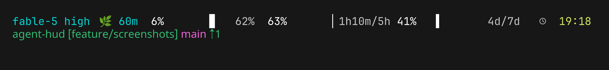
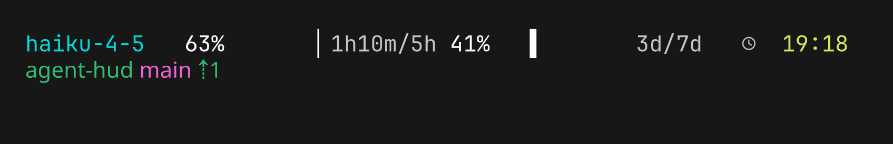

# agent-hud

*2026-07-17T23:17:57Z by Showboat 0.6.1*
<!-- showboat-id: 0ab2afe3-6dec-486d-bbef-493c61e8ea78 -->

A busy session: model and effort, cache miss rate, context-used bar, both rate-limit bars with reset countdowns, clock — then the repo, worktree branch, and jj drift on line two.

```bash {image}

```



A second session given no rate-limit data on stdin: the bars still render, merged from the on-disk DB the first session wrote. Everything else degrades quietly — model, clock, repo.

```bash {image}

```


